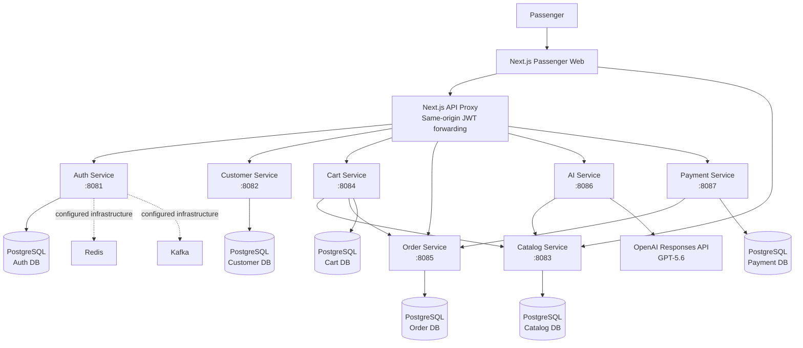
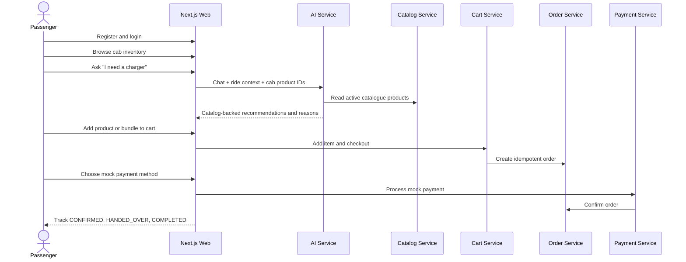

# InRideMart – AI-Powered In-Ride Shopping Concierge 🚕

[](https://openjdk.org/)
[](https://spring.io/projects/spring-boot)
[](https://nextjs.org/)
[](https://platform.openai.com/)
[](https://www.docker.com/)

> An OpenAI Build Week project that turns ride time into a useful, low-friction shopping moment.

## Project Overview

Passengers often realise they need a charger, water, snacks, rain protection, or a travel-comfort item only after they are already on the move. Stopping to find a shop interrupts the journey, while browsing a generic catalogue is slow and rarely tailored to the ride.

**InRideMart** is an AI-powered in-ride shopping concierge. It combines natural-language conversation, ride context, budget, and demo cab inventory to help a passenger discover relevant convenience products, add them to a cart, complete a mock payment, and track fulfilment through handover.

## Problem Statement

In-ride convenience shopping has three practical challenges:

- Passengers need small, time-sensitive items without interrupting their journey.
- Recommendations must respect what is actually available in the cab and what the passenger can afford.
- Passenger-driver communication can become difficult when they do not share a language.

## Solution Overview

InRideMart provides a mobile-first passenger web experience backed by focused Spring Boot services. The AI Service interprets shopping requests, asks follow-up questions when needed, and returns only products supplied by the Catalog Service and allowed for the assigned demo cab.

```text
Ride context -> Catalog / AI discovery -> Cart -> Checkout -> Mock payment -> Order tracking
```

## Key Features ✨

| Feature | Status | What it does |
| --- | --- | --- |
| AI Conversational Shopping Assistant | Implemented | Understands requests, asks concise follow-ups, and returns catalog-grounded recommendations. |
| Context-aware recommendations | Implemented | Uses the latest request, budget follow-ups, destination, weather, purpose, duration, and available product IDs supplied by the web app. |
| Assigned cab inventory | Implemented for the demo cab | Filters live Catalog products through an assigned-cab product allow-list. |
| Smart travel bundles | Implemented | Builds catalog-backed airport, charging, rainy-day, and snack-oriented bundles. |
| Cart and checkout | Implemented | Adds catalog products to a passenger cart and creates an order. |
| Mock payment | Implemented | Supports UPI, credit card, debit card, and wallet selections without collecting payment details. |
| Order tracking | Implemented | Tracks `PLACED -> CONFIRMED -> HANDED_OVER -> COMPLETED`. |
| Multilingual Passenger <-> Driver Assistant | Implemented | Detects passenger language and translates ride conversations in supported Indian and international languages. |

## AI Features

### Conversational shopping

The assistant handles greetings, explicit needs, and follow-up turns. A broad request such as `snacks` prompts for a preference, while a precise request such as `protein bar`, `charger`, or `headphones` returns relevant catalog products.

### Catalog-grounded recommendations

The AI Service reads active products from the **Catalog Service** over HTTP. It matches product name, category, description, and intent keywords, then applies the assigned-cab and budget constraints. It never creates product IDs, prices, stock, or catalogue entries.

### Context and explainability

Ride context is sent with every AI request: destination, weather, journey duration, travel purpose, time of day, and available product IDs. Recommendations include a reason for each selected product. A budget-only follow-up such as `INR 500` retains the immediately previous shopping intent without allowing an older, unrelated topic to take over.

### Personalization

Current personalization is intentionally based on explicit passenger conversation, active ride context, budget, and the available cab inventory. Customer profile summary data can support conversational follow-ups; a persisted preference model is not implemented yet and is listed under future enhancements.

### Smart bundles

When several available products complement the trip, the response includes an optional bundle with a calculated total. Airport bundles prioritise distinct travel needs such as comfort and charging rather than repeating a single product type.

### Multilingual ride communication

`POST /api/v1/ai/translate` detects the passenger's language, translates the passenger message for the driver, and can translate the driver's reply back. It supports English, Hindi, Kannada, Telugu, Tamil, Malayalam, Marathi, Bengali, Gujarati, Punjabi, Urdu, Spanish, French, German, Portuguese, Italian, Dutch, Russian, Arabic, Turkish, Chinese, Japanese, Korean, Thai, Vietnamese, and Indonesian.

When `OPENAI_API_KEY` is configured, GPT-5.6 uses the Responses API for multilingual translation and conversational ambiguity. Deterministic catalog matching remains in the AI Service so product truth is preserved even if the model or network is unavailable.

## System Architecture 🏗️



### Service Ownership

| Service | Port | Responsibility |
| --- | ---: | --- |
| Auth Service | 8081 | Registration, login, JWT issuance, and authenticated identity. |
| Customer Service | 8082 | Passenger profile and address data. |
| Catalog Service | 8083 | Product catalogue, categories, pricing, and images. |
| Cart Service | 8084 | Passenger cart items and checkout orchestration. |
| Order Service | 8085 | Orders, idempotent creation, and tracking state. |
| AI Service | 8086 | Conversational shopping, catalog-grounded ranking, bundles, and translations. |
| Payment Service | 8087 | Mock payment records and order confirmation. |

Each business service owns its PostgreSQL data. Auth issues a JWT; protected services validate the same issuer and shared `JWT_SECRET`. The frontend does not bypass service ownership.

## Technology Stack

| Area | Technology |
| --- | --- |
| Backend | Java 21, Spring Boot 3.5, Spring Security, JPA/Hibernate, Flyway |
| Frontend | Next.js 16, React 19, TypeScript, Tailwind CSS |
| AI | OpenAI Responses API, configurable GPT-5.6 model |
| Data | PostgreSQL 16, Redis 7, Apache Kafka 3.9 |
| Build and tooling | Maven multi-module monorepo, npm, Docker Compose |
| API documentation | OpenAPI / Swagger UI where Springdoc is enabled |
| Testing | JUnit 5, Mockito, Spring Boot test support |

## Project Structure

```text
InRideMart/
|- frontend/                         # Next.js passenger experience
|  |- src/app/                       # Routes and API proxy
|  |- src/components/                # Storefront, auth, AI chat UI
|  |- src/lib/                       # Session, catalog, ride-context helpers
|- services/
|  |- auth-service/                  # JWT authentication
|  |- customer-service/              # Passenger profiles
|  |- catalog-service/               # Product catalogue
|  |- cart-service/                  # Cart and checkout
|  |- order-service/                 # Orders and tracking
|  |- payment-service/               # Mock payments
|  |- ai-service/                    # Shopping and translation AI
|- deploy/postgres/init/             # Demo database creation scripts
|- docker-compose.yml                # PostgreSQL, Redis, Kafka
|- start-inridemart.ps1              # Local all-services launcher
|- pom.xml                           # Maven reactor
```

## Prerequisites

- Java 21 or later
- Maven 3.9 or later
- Node.js 20.9 or later
- Docker Desktop with Docker Compose
- PowerShell on Windows for `start-inridemart.ps1`

Verify local tooling:

```powershell
java -version
mvn -version
node --version
npm --version
docker --version
docker compose version
```

## Environment Variables

Set values in the PowerShell session that starts the application. Never commit real secrets.

| Variable | Required | Example | Purpose |
| --- | --- | --- | --- |
| `INRIDEMART_DB_PASSWORD` | Yes | `InRide@123` | Local PostgreSQL password used by the services. |
| `JWT_SECRET` | Yes | `replace-with-a-32-byte-minimum-secret` | Shared HMAC secret for Auth-issued JWT validation. |
| `INRIDEMART_JWT_ISSUER` | Optional | `inridemart-auth` | JWT issuer; defaults to `inridemart-auth`. |
| `OPENAI_API_KEY` | Optional | `sk-...` | Enables GPT-5.6 Responses API capabilities. |
| `OPENAI_MODEL` | Optional | `gpt-5.6` | Overrides the default OpenAI model. |
| `OPENAI_TEMPERATURE` | Optional | `0.2` | Generation temperature for non-GPT-5 controls. |
| `OPENAI_MAX_OUTPUT_TOKENS` | Optional | `350` | Output limit for OpenAI responses. |
| `INRIDEMART_CATALOG_BASE_URL` | Optional | `http://localhost:8083` | Catalog URL used by dependent services. |
| `INRIDEMART_ORDER_BASE_URL` | Optional | `http://localhost:8085` | Order URL used by Cart and Payment. |
| `INRIDEMART_*_DB_URL` | Optional | `jdbc:postgresql://localhost:5433/inridemart_catalog` | Per-service database URL override. |
| `CATALOG_API_BASE_URL` | Optional | `http://localhost:8083` | Frontend catalog API override. |

Example local session:

```powershell
$env:INRIDEMART_DB_PASSWORD = "InRide@123"
$env:JWT_SECRET = "replace-this-with-your-local-32-byte-minimum-secret"
$env:OPENAI_API_KEY = ""
$env:OPENAI_MODEL = "gpt-5.6"
```

Without an OpenAI key, the AI Service remains usable through its deterministic, catalog-grounded fallback. The provided launcher sets local demo defaults for the database password and JWT secret; replace them before sharing a deployment.

## Setup Instructions

### 1. Clone the repository

```powershell
git clone <your-repository-url>
cd InRideMart
```

### 2. Start Docker and all services

Set an OpenAI key for live GPT-5.6 features, or leave it empty for the deterministic demo path:

```powershell
$env:OPENAI_API_KEY = "sk-..."
.\start-inridemart.ps1
```

The script starts PostgreSQL, Redis, and Kafka through Docker Compose, waits for PostgreSQL, opens a PowerShell window for each Spring Boot service, and opens the Next.js development server.

### 3. Access the application

| Surface | URL |
| --- | --- |
| Passenger web app | [http://localhost:3000](http://localhost:3000) |
| AI Shopping Assistant | [http://localhost:3000/ai](http://localhost:3000/ai) |
| Docker-managed PostgreSQL | `localhost:5433` |
| Redis | `localhost:6379` |
| Kafka | `localhost:9092` |

### Alternative manual startup

```powershell
docker compose up -d
mvn -pl services/auth-service spring-boot:run
mvn -pl services/customer-service spring-boot:run
mvn -pl services/catalog-service spring-boot:run
mvn -pl services/cart-service spring-boot:run
mvn -pl services/order-service spring-boot:run
mvn -pl services/ai-service spring-boot:run
mvn -pl services/payment-service spring-boot:run
```

In a separate terminal:

```powershell
cd frontend
npm install
npm run dev
```

## Sample Demo Flow 🎬



Suggested judge walkthrough:

1. Create an account and sign in.
2. Set ride context on the Home screen: destination, duration, weather, and travel purpose.
3. Browse products available in the assigned demo cab.
4. Open **AI Shopping** and try `Hi`, `protein bar`, `I need a charger`, `airport essentials`, or `INR 500` after a shopping request.
5. Add a recommended item or bundle to the cart.
6. Checkout and choose UPI, credit card, debit card, or wallet.
7. Verify payment is `PAID`, the order is `CONFIRMED`, then progress it through `HANDED_OVER` and `COMPLETED`.
8. Use **Translate conversation** to demonstrate passenger-driver communication in a supported language.

## API Documentation

### Swagger / OpenAPI

| Service | Swagger UI | Notes |
| --- | --- | --- |
| Auth | [http://localhost:8081/swagger-ui.html](http://localhost:8081/swagger-ui.html) | Register, login, and authenticated identity. |
| Customer | [http://localhost:8082/swagger-ui.html](http://localhost:8082/swagger-ui.html) | Customer profile APIs. |
| Catalog | [http://localhost:8083/swagger-ui.html](http://localhost:8083/swagger-ui.html) | Public catalogue and category APIs. |
| Cart | Not currently exposed | Cart APIs exist at `/api/v1/carts/me`; Springdoc UI is not configured in this module. |
| Order | [http://localhost:8085/swagger-ui.html](http://localhost:8085/swagger-ui.html) | Order creation, retrieval, and tracking. |
| AI | [http://localhost:8086/swagger-ui.html](http://localhost:8086/swagger-ui.html) | AI chat and translation APIs. |
| Payment | Not currently exposed | Payment APIs exist at `/api/v1/payments`; Springdoc UI is not configured in this module. |

### Important endpoints

| Method | Endpoint | Description |
| --- | --- | --- |
| `POST` | `/api/v1/auth/register` | Register a customer account. |
| `POST` | `/api/v1/auth/login` | Obtain a JWT access token. |
| `GET` | `/api/v1/catalog/products` | Browse or search the active catalogue. |
| `POST` | `/api/v1/ai/chat` | Send a shopping request with optional ride context. |
| `POST` | `/api/v1/ai/translate` | Translate a passenger-driver conversation. |
| `POST` | `/api/v1/carts/me/items` | Add a product to the authenticated passenger cart. |
| `POST` | `/api/v1/carts/me/checkout` | Checkout the active cart. |
| `POST` | `/api/v1/payments` | Process a mock payment and confirm an order. |
| `PATCH` | `/api/v1/orders/{id}/tracking` | Move an order to `HANDED_OVER` or `COMPLETED`. |

## Screenshots

Add final demo screenshots to `docs/screenshots/` before publishing. These are intentional placeholders and do not reference missing files.

| Screen | Placeholder |
| --- | --- |
| Home | `docs/screenshots/home.png` |
| AI Chat | `docs/screenshots/ai-chat.png` |
| Catalog | `docs/screenshots/catalog.png` |
| Cart | `docs/screenshots/cart.png` |
| Checkout | `docs/screenshots/checkout.png` |
| Payment | `docs/screenshots/payment.png` |
| Order Tracking | `docs/screenshots/order-tracking.png` |

## How GPT-5.6 Was Used

GPT-5.6 is integrated through the OpenAI **Responses API** inside the dedicated AI Service. It is used for:

- Natural conversational follow-up questions when a passenger's need is ambiguous.
- Interpreting conversational context without creating product data.
- Multilingual passenger-driver translations while preserving meaning and tone.
- Supporting the conversational layer around explainable recommendations and bundles.

Catalog matching, price handling, cab inventory enforcement, and bundle totals remain deterministic service responsibilities. This separation means the model cannot invent products, prices, or availability, and the demo still works when the OpenAI API is unavailable.

## How Codex Accelerated Development

Codex was used as an engineering collaborator throughout the Build Week implementation. It accelerated:

- Incremental microservice development within the Maven monorepo.
- Next.js passenger UI, authentication flow, protected pages, and responsive states.
- API proxy integration across Auth, Customer, Catalog, Cart, Order, Payment, and AI services.
- JWT and Spring Security investigation across services and the frontend proxy.
- OpenAI Responses API integration, structured response handling, and deterministic fallbacks.
- AI recommendation testing, catalog-grounding safeguards, and multilingual-flow validation.
- Mock payment and order-tracking UX refinement.
- Test creation, manual end-to-end verification, architecture documentation, and this submission README.

## Key Architectural Decisions

| Decision | Why it was chosen |
| --- | --- |
| Microservices by bounded context | Keeps authentication, catalogue, cart, orders, payments, customers, and AI responsibilities separate. |
| Dedicated AI Service | Contains all OpenAI interaction and orchestration without placing model calls in controllers or product services. |
| Catalog as product source of truth | Prevents AI or frontend code from inventing products, prices, or availability. |
| Cab inventory allow-list | Ensures the demo only offers products stocked in the assigned cab. Live inventory synchronisation is explicitly future work. |
| Next.js API proxy | Provides same-origin frontend calls and forwards Authorization and idempotency headers to backend services. |
| JWT with stateless Spring Security | Supports a web client today and mobile clients later without server-side sessions. |
| Mock payment | Demonstrates the checkout lifecycle safely without collecting payment data or integrating a real gateway. |
| Docker Compose infrastructure | Makes PostgreSQL, Redis, and Kafka reproducible for local development. |
| GPT-5.6 with deterministic grounding | Adds natural language and translation intelligence while preserving predictable, catalog-backed commerce rules. |

## Future Enhancements 🔭

The following are **not implemented** in the current hackathon MVP:

- Live driver and cab inventory management.
- Dynamic inventory synchronisation with merchants or drivers.
- Production payment-gateway integration.
- Ride booking and real-time ride context integration.
- Voice-first shopping and translation assistant.
- Predictive recommendations based on opted-in history.
- Loyalty rewards, offers, and repeat-purchase flows.

## Contributors

| Contributor | Role |
| --- | --- |
| [sohail9972](https://github.com/sohail9972) | Project creator and primary contributor |

## License

No license file is currently included in this repository. All rights are reserved unless the project owner adds an explicit license.
