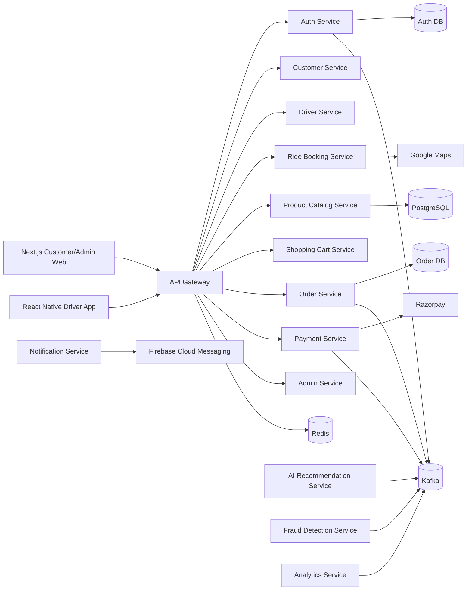
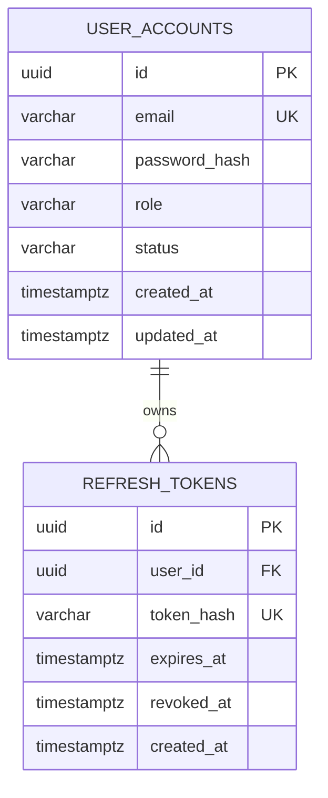
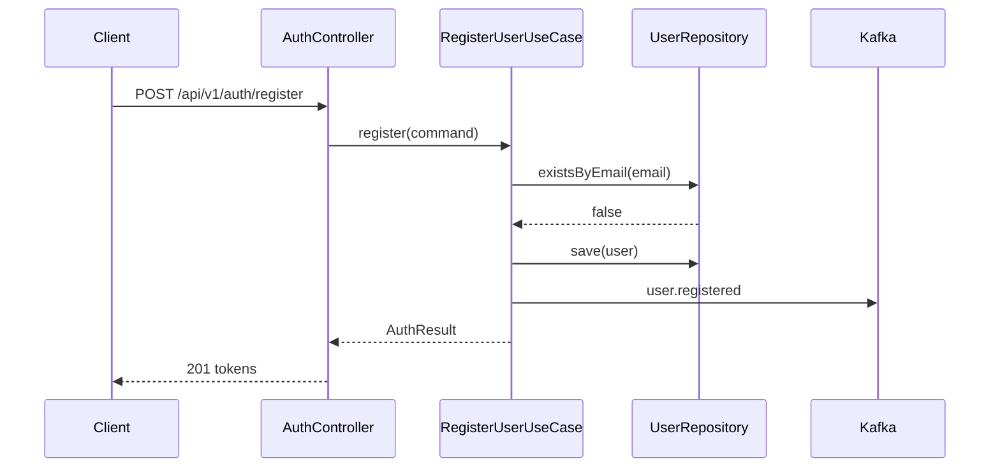
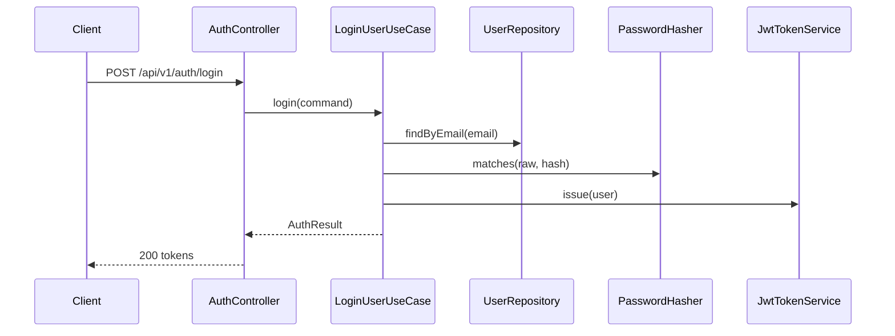

# InRideMart System Design

## 1. System Design

InRideMart is a commerce layer embedded in the ride journey. Customers can browse products relevant to their ride, merchants expose catalogs and inventory, drivers fulfill selected handoff workflows, and the platform coordinates ordering, payment, recommendations, notifications, fraud scoring, and analytics.

Core style:

- Microservices by bounded context.
- Clean Architecture inside each service.
- Hexagonal adapters for HTTP, persistence, messaging, third-party APIs, and schedulers.
- Domain events on Kafka for cross-service workflows.
- PostgreSQL per service for transactional ownership.
- Redis for cache, rate limits, sessions, idempotency windows, and low-latency reads.
- REST APIs documented through OpenAPI.
- JWT authentication with short-lived access tokens and refresh-token rotation.
- Kubernetes-native deployment with readiness/liveness probes.

## 2. High-Level Design



## 3. Low-Level Design

Every Spring Boot service follows the same package layout:

- `domain`: aggregates, value objects, domain events, repository ports.
- `application`: use cases, command/query models, transaction boundaries.
- `adapters.in.web`: REST controllers, DTOs, exception mapping.
- `adapters.out.persistence`: JPA entities, Spring Data repositories, mappers.
- `adapters.out.messaging`: Kafka publishers/consumers.
- `adapters.out.thirdparty`: Razorpay, Firebase, Google Maps clients.
- `config`: security, OpenAPI, infrastructure beans.

Authentication service aggregate:

- `UserAccount`
- `EmailAddress`
- `Role`
- `UserRegisteredEvent`

Authentication use cases:

- Register user.
- Login with email/password.
- Issue signed JWT access token.
- Issue refresh token.
- Validate bearer token.

## 4. Database Schema

Each microservice owns its schema. Initial implemented schema:

```sql
CREATE TABLE user_accounts (
  id UUID PRIMARY KEY,
  email VARCHAR(320) NOT NULL UNIQUE,
  password_hash VARCHAR(255) NOT NULL,
  role VARCHAR(40) NOT NULL,
  status VARCHAR(40) NOT NULL,
  created_at TIMESTAMPTZ NOT NULL,
  updated_at TIMESTAMPTZ NOT NULL
);

CREATE TABLE refresh_tokens (
  id UUID PRIMARY KEY,
  user_id UUID NOT NULL REFERENCES user_accounts(id),
  token_hash VARCHAR(255) NOT NULL UNIQUE,
  expires_at TIMESTAMPTZ NOT NULL,
  revoked_at TIMESTAMPTZ,
  created_at TIMESTAMPTZ NOT NULL
);
```

Future service schemas:

- Customer: profiles, addresses, preferences.
- Driver: driver profiles, vehicle documents, availability.
- Merchant: merchant profiles, outlets, service zones.
- Ride Booking: rides, stops, route snapshots, ETA events.
- Catalog: products, categories, prices, merchant product availability.
- Cart: carts, cart items, promotions.
- Orders: orders, order items, fulfillment states.
- Inventory: stock ledger, reservations, reconciliation.
- Payments: payment intents, transactions, refunds, webhooks.
- Notifications: notification templates, delivery attempts.
- Analytics: fact tables, aggregates, event projections.
- Fraud: risk signals, scores, decisions, review queues.

## 5. ER Diagram



## 6. Sequence Diagrams

### Register



### Login



## 7. API Contracts

Implemented endpoints:

- `POST /api/v1/auth/register`
- `POST /api/v1/auth/login`
- `GET /api/v1/auth/me`

OpenAPI is generated at runtime:

- JSON: `/v3/api-docs`
- UI: `/swagger-ui.html`

## 8. Folder Structure

```text
services/auth-service
  src/main/java/com/inridemart/auth
    domain
    application
    adapters/in/web
    adapters/out/messaging
    adapters/out/persistence
    config
  src/main/resources
    db/migration
  src/test/java
deploy/kubernetes/auth-service
.github/workflows
```

## 9. Source Code

The first source implementation is in `services/auth-service`.

## 10. Docker Compose

`docker-compose.yml` starts PostgreSQL, Redis, Kafka, Zookeeper, and the auth service image.

## 11. Kubernetes Manifests

Initial manifests are under `deploy/kubernetes/auth-service`.

## 12. CI/CD Pipelines

GitHub Actions build, test, and package the Maven service. Container publishing can be enabled by adding registry credentials.

## 13. Test Cases

Current test coverage:

- Email value object validation.
- Registration use case duplicate-email behavior.
- Login use case credential validation.
- Auth REST API happy path with H2-backed integration test.

## 14. Deployment Guide

1. Create Kubernetes secrets for database, JWT, Kafka, Redis, Razorpay, Firebase, and Google Maps.
2. Deploy infrastructure operators or managed services.
3. Apply service manifests.
4. Run Flyway migrations at application startup or as a migration job.
5. Route external traffic through ingress/API gateway.
6. Enable metrics, logs, tracing, alerting, and backup policies.

## 15. Production Best Practices

- Use managed PostgreSQL with PITR, encrypted storage, and separate databases per service.
- Rotate JWT signing keys and support `kid` headers when asymmetric keys are introduced.
- Store refresh tokens as hashes only.
- Require idempotency keys on payment and order mutation APIs.
- Validate Razorpay and Firebase webhook signatures.
- Apply Kafka schema governance for event contracts.
- Add outbox tables for exactly-once publication where business critical.
- Use network policies, pod security standards, and least-privilege service accounts.
- Enforce rate limits on auth and payment endpoints.
- Run SAST, dependency scans, container scans, and IaC scans in CI.

